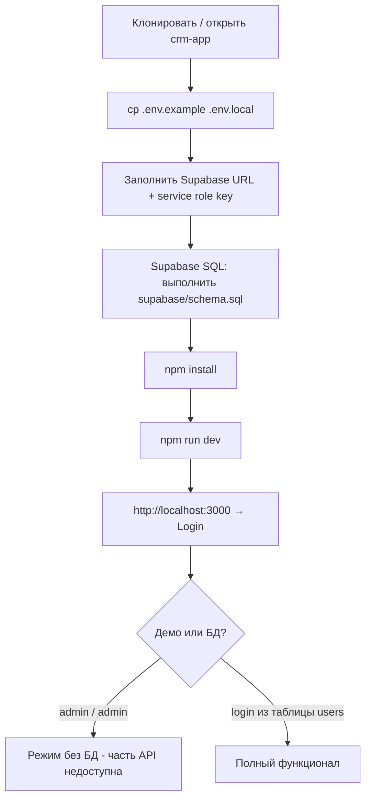

# Asia Mix CRM - схема запуска

## Обзор потока



## 1. Требования

- **Node.js** 20+ (рекомендуется LTS)
- Аккаунт **Supabase** (бесплатный тариф подойдёт)

## 2. Переменные окружения

Из корня приложения:

```bash
cp .env.example .env.local
```

Заполните в `.env.local`:

| Переменная | Назначение |
|------------|------------|
| `NEXT_PUBLIC_SUPABASE_URL` | URL проекта Supabase |
| `SUPABASE_SERVICE_ROLE_KEY` | Service Role Key (только сервер, не светить в клиент) |
| `RECEIPT_PREFIX` | Префикс номеров квитанций (например `AMX`) |

`NEXT_PUBLIC_SUPABASE_ANON_KEY` и `DATABASE_URL` в `.env.example` - опционально для будущего RLS/Auth; текущие API используют **service role** на сервере.

## 3. База данных

1. Откройте проект в [Supabase Dashboard](https://supabase.com/dashboard) → **SQL Editor**.
2. Вставьте содержимое файла **`supabase/schema.sql`** из репозитория и выполните **Run**.
3. Пользователей можно добавить вручную в **`users`** или один раз выполнить **`supabase/seed-users.sql`** (готовые логины `director`, `manager`, … пароль `admin`).  
   - Пароль в схеме MVP хранится **как введён** (для продакшена нужен хеш / Supabase Auth).
4. Для страницы **Билеты** один раз выполните **`supabase/seed-ticket-templates.sql`** (если шаблонов ещё нет).

## 4. Установка и команды

```bash
cd crm-app
npm install
npm run dev
```

Откройте **http://localhost:3000**.

**С телефона в одной Wi‑Fi сети с компьютером:** `npm run dev:lan`, затем в браузере телефона `http://<IP_компьютера>:3000` - подробно по-русски: [ZAPUSK-TELEFON.md](./ZAPUSK-TELEFON.md).

Полезные команды:

| Команда | Назначение |
|---------|------------|
| `npm run dev` | Разработка |
| `npm run build` | Сборка production |
| `npm run start` | Запуск после `build` |
| `npm run lint` | ESLint |
| `npm run typecheck` | TypeScript без emit |

## 5. Вход в систему

- **Демо без настроенного Supabase:** логин `admin`, пароль `admin` - сессия с id `demo-director` (UUID-операции профиля и часть FK недоступны).
- **Рабочий режим:** пользователь с **`users.id` = UUID** и заполненными `login` / `password` - тогда работают профиль, платежи, гиды, выходные и т.д.

## 6. Продакшен (кратко)

1. `npm run build` → задеплоить на Vercie / Node-хостинг.
2. В настройках хоста задать те же env, **включая** `SUPABASE_SERVICE_ROLE_KEY`.
3. `secure: true` для cookie сессии уже завязан на `NODE_ENV === "production"` в `/api/profile` (и при необходимости продублируйте для login route).

## 7. Что уже покрыто в приложении

- Туры, брони, оплаты, мягкое удаление, PDF-квитанции, автобусы, назначение гидов (в т.ч. lead), ростер и выходные менеджеров/гидов.
- Дашборд: фильтры **Все туры / Мои туры / Мои продажи**.
- Финансы: суммы по `payments` и `expenses`, период месяц / всё время (`?month=`), последние платежи, форма расхода на тур (`POST /api/expenses`).
- Билеты: сводка по `ticket_sales` + шаблоны, форма продажи в UI.

Дальнейшее усиление: Supabase Auth, хеш паролей.
