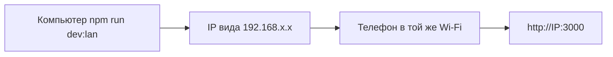

# Как открыть Asia Mix CRM с телефона и что уже работает

## Зачем отдельная команда

Обычный `npm run dev` часто слушает только **localhost** - с телефона по Wi‑Fi до него не достучаться.  
Команда **`npm run dev:lan`** поднимает сервер на **всех интерфейсах** (`0.0.0.0`), и тогда можно зайти с телефона по **локальному IP** компьютера.

---

## Пошагово: Mac / Windows + телефон в одной Wi‑Fi сети

### 1) На компьютере - как обычно подготовить проект

```bash
cd crm-app
cp .env.example .env.local
```

В `.env.local` должны быть **реальные** `NEXT_PUBLIC_SUPABASE_URL` и `SUPABASE_SERVICE_ROLE_KEY`.  
В Supabase уже выполнен **`supabase/schema.sql`**, при необходимости - **`supabase/seed-ticket-templates.sql`** (шаблоны билетов).

```bash
npm install
npm run dev:lan
```

В терминале будет что-то вроде: `Ready on http://0.0.0.0:3000`.

### 2) Узнать IP компьютера в локальной сети

- **macOS:** «Системные настройки» → **Wi‑Fi** → **Подробнее…** → IP-адрес  
  или в терминале: `ipconfig getifaddr en0` (часто Wi‑Fi).
- **Windows:** `ipconfig` → **IPv4-адрес** у активного Wi‑Fi (например `192.168.1.105`).

Допустим, IP = **`192.168.1.105`**.

### 3) На телефоне

1. Подключитесь к **той же Wi‑Fi**, что и компьютер (не мобильный интернет оператора для этого шага).
2. Откройте браузер (Safari / Chrome).
3. Введите адрес:

```text
http://192.168.1.105:3000
```

(подставьте **свой** IP и порт **3000**, если не меняли).

4. Вас перекинет на дашборд или логин. Войдите:
   - **Демо:** `admin` / `admin` - без своей БД часть функций ограничена.
   - **Полный режим:** логин/пароль из таблицы **`users`** в Supabase (у пользователя должен быть **UUID** в `id`).

### 4) Если страница не открывается

| Симптом | Что проверить |
|--------|----------------|
| Таймаут / не грузится | Запущен ли `dev:lan`, тот ли **IP** и **порт 3000**. |
| На Mac не пускает | «Системные настройки» → **Сеть** → **Брандмауэр** - разрешить **Node** входящие для локальной сети. |
| VPN на телефоне | Отключить VPN - иногда ломает доступ к локальной сети. |
| Разные сети | Телефон на LTE, ноутбук на Wi‑Fi - **не сработает** без туннеля (ниже). |

### 5) Если нужно с телефона через интернет (не дома)

Тогда локальный IP не подойдёт. Варианты:

- **Туннель** (например [ngrok](https://ngrok.com)): на ПК `ngrok http 3000`, открыть выданный https-URL на телефоне.  
- Или задеплоить приложение на **Vercel** / другой хост и открыть публичный URL.

---

## Production-сборка с телефона в той же сети

```bash
npm run build
npm run start:lan
```

Дальше снова `http://ВАШ_IP:3000` с телефона.

---

## Что в CRM уже можно «потрогать» с телефона

| Раздел | Что делает |
|--------|------------|
| **Вход** | `/login` - сессия в cookie, удобно с мобильного. |
| **Дашборд** | Список туров; фильтры **Все / Мои туры (гид) / Мои продажи**. |
| **Тур** | Брони, оплаты (если есть права), WhatsApp, PDF-квитанция, удаление по правилам, автобусы, **назначение гидов** и **ведущий**. |
| **Новая бронь** | Форма туриста с автосохранением; у директора/главного менеджера - выбор менеджера продаж из списка. |
| **Team** | Кто в офисе / выходные менеджеров и гидов (как в ТЗ). |
| **Profile** | Имя/пароль (для UUID-пользователя), свои выходные. |
| **Finance** | Сводка по `payments` и `expenses` (роли director / chief_manager / accountant). |
| **Билеты** | Форма **новой продажи** + сводка по типам (нужны шаблоны из seed SQL). |
| **Deleted** | Список удалённых броней и восстановление (по ролям). |

Интерфейс **узкий** (`max-width: 560px`) - рассчитан на телефон.

---

## Короткая схема



Если что-то из списка «не работает» - почти всегда не хватает **env + SQL в Supabase** или вход не под **UUID-пользователем**. Тогда см. также [LAUNCH.md](./LAUNCH.md).
